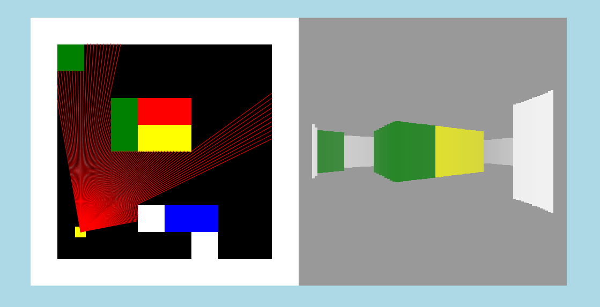
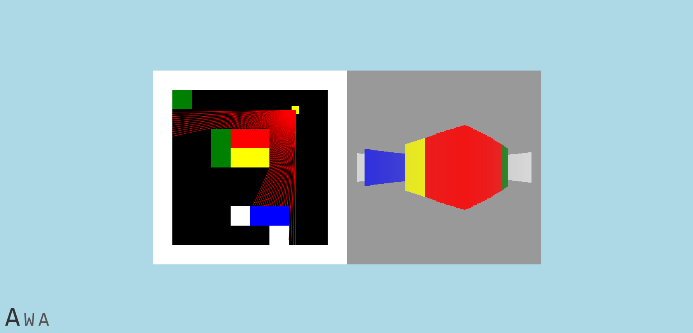
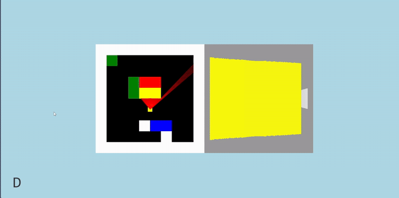

# Raycaster
A raycaster made in HTML usind JavaScript.

## Controls
- Move Forwards by using `W`
- Move Backward by using `S`
- To turn use either `a` or `d`

- You can `right click` the tiles (on the topdown view) to `change their color`

## Disclaimer
Be careful when `changing the colors` of the `boundary walls` as it can cause the site to `crash`!

## Screenshots

  
  
  

## Assets
- Based on the [Make Your Own Raycaster](https://www.youtube.com/watch?v=gYRrGTC7GtA) series by [3DSage](https://www.youtube.com/@3DSage)
